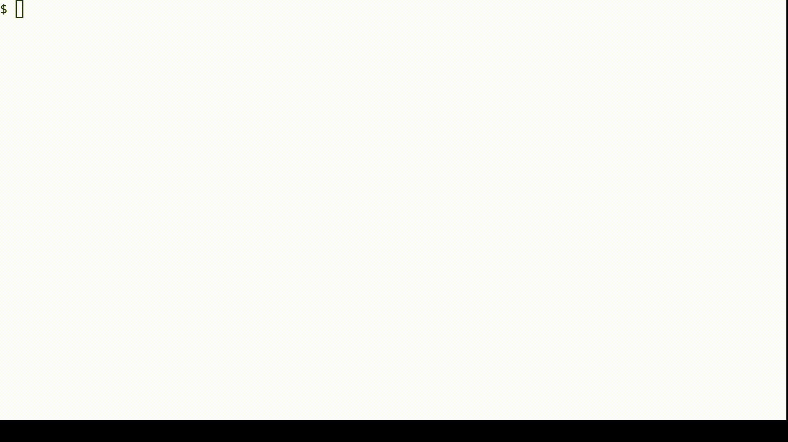

# dot-simplify

## DOT, GraphViz and graph descriptions

A project that lets you simplify graph descriptions in a sublanguage of
[DOT](https://en.wikipedia.org/wiki/DOT_(graph_description_language)). A graph
described in DOT can be drawn using `dot` program, a part of
[GraphViz](https://en.wikipedia.org/wiki/Graphviz) package. Here's an online
[tool](<https://dreampuf.github.io/GraphvizOnline/>) to see how this works.

This project takes a description of a directed graph (`digraph`) without
multiple edges (`strict`) conforming to the grammar provided below, and
simplifies that description. The grammar allows descriptions using subgraphs and
nesting, and the output description is a simple list of neighbouring nodes for
each node in the graph.

Project works for a Linux system with a working gcc compiler, to run tests you
should have [valgrind](https://valgrind.org/). A [Makefile](Makefile) with a
default compilation command is supplied. It also has phony targets clean and
test. Running `make` produces a `build/dot-simplify` binary, which operates on
standard input and standard output, with no support for files as command line
arguments.

## Demo



## Input descriptions

The following is a context-free grammar in the extended BNF notation which
describes possible input:

```text
graph = "strict" "digraph" subgraph ;
subgraph = "{" { nodes { "->" nodes } } "}" ;
nodes = ID | subgraph ;
```

Auxiliary symbols are identifiers composed of lowercase letters, final symbols
are either composed of capital letters or are encased in quotes. Symbols
surrounded by braces can repeat zero or more times. `|` means an alternative,
`;` is the end of a rule. Starting symbol is `graph`, `ID` means a non-negative
integer without leading zeros that can be stored in an `int` type.

The graph has a hierarchical structure. It consists of subgraphs, which can be
nested. Subgraphs are not separate. A node or an edge can belong to multiple
subgraphs. Each node and every edge of the subgraph also belong to the graph in
which this subgraph is nested. A graph node is represented by a non-negative
integer ID. `->` indicates the direction of edges. `G -> H` means for each node
in subgraph `G` there is an edge to every node in subgraph `H`. If either `G` or
`H` are single nodes instead, they are treated as a subgraph with one node.

In case of any doubts, consult the linked online
[tool](<https://dreampuf.github.io/GraphvizOnline/>).

## Output format

The result of the program is described by grammar:

```text
graph = "digraph" "{" { ID "->" "{" { ID } "}" } "}" ;
```
